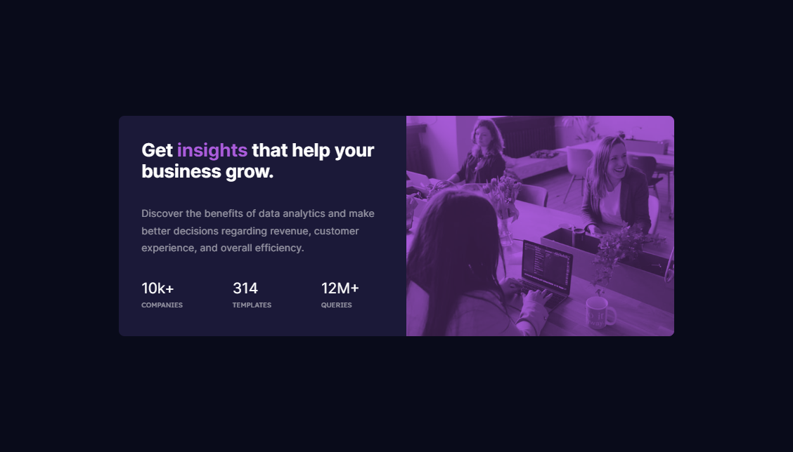

# Frontend Mentor - Stats preview card component solution

This is a solution to the [Stats preview card component challenge on Frontend Mentor](https://www.frontendmentor.io/challenges/stats-preview-card-component-8JqbgoU62). Frontend Mentor challenges help you improve your coding skills by building realistic projects. 

## Table of contents

  - [The challenge](#the-challenge)
  - [Screenshot](#screenshot)
  - [Links](#links)
- [My process](#my-process)
  - [Built with](#built-with)
  - [What I learned](#what-i-learned)
  - [Continued development](#continued-development)
  - [Useful resources](#useful-resources)
- [Author](#author)
- [Acknowledgments](#acknowledgments)

### The challenge

Users should be able to:

- View the optimal layout depending on their device's screen size

### Screenshot



### Links

- Solution URL: https://github.com/luciaguerra/stats-preview-card-component-main
- Live Site URL: https://stats-preview-card-component001.netlify.app/

## My process
This challenge was a _whole challenge_ for me. Media queries are still a little tricky for me and probably I changed values and breakpoints a million times for the design to look responsive enough and not break that much was I was trying to build.

Nevertheless, I did a breakpoint with a combination of both desktop and mobile designs to create a tablet responsive design.


I went through a bunch of important decisions until I made the 'final cut', if should I use Grid or Flexbox, changing and modifying each line to see what look better and breaks the less when switching breakpoints.

It was fun to do and challenging enough to get me entertained through the weekend!

### Built with

- Semantic HTML5 markup
- CSS custom properties
- Flexbox

### What I learned
With this I learnt some new basic properties I didn't know much about and got surprised by how much CSS can actually do!

To apply the image into the design I used these lines and loved the results.

```css
img {
    width: 100%;
    object-fit: cover;
    mix-blend-mode: multiply;
    opacity: 70%;
}
```

### Continued development
I'd like to keep learning about responsive design and master it as much as possible. It's important for everyone to be able to access their favourite webpages from every device they like and also keep it accesible using semantic HTML, something I still have to pay attention to.

Also, I have to keep practicing a looot of CSS properties that are very important in the Front-End Developer proffesion to make cool websites.

### Useful resources

- [How to swap image with media queries](https://stackoverflow.com/questions/27853884/media-queries-and-image-swapping) - I felt completely lost when trying to change the desktop image to the mobile one and this cleared my mind!
- [Prevent background-color from overlapping border-radius](https://stackoverflow.com/questions/44913305/background-color-overlapping-border-radius) - I got a little confused when I saw the border-radius not being applied onto the image but this helped me a lot.
- [mix-blend-mode](https://developer.mozilla.org/en-US/docs/Web/CSS/mix-blend-mode) - I knew about filter properties in CSS but didn't know about blend modes! It was fun to know this and I will 100% sure use it again in the future for next projects!

## Author

- Frontend Mentor - [@luciaguerra](https://www.frontendmentor.io/profile/luciaguerra)
- Twitter - [@lucihtml](https://www.twitter.com/lucihtml)